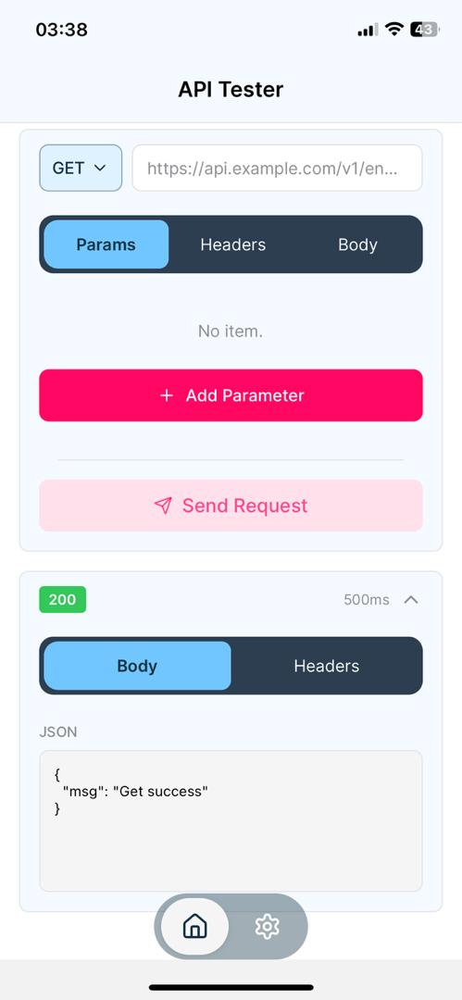

# Postdroid

An API tester app built with React Native. Postdroid is bringing the essential features of Postman to your fingertips—right from your mobile device.

## Features

- Test **RESTful APIs** on the go
- Send **GET**, **POST**, **PUT**, **DELETE**, **PATCH**, **OPTIONS**, **HEAD**
- Customize **request headers**, **body**, and **query parameters**
- View **response status**, **headers**, and **body**
- Monitor **response time**
- Simple and intuitive **mobile-first UI**
- Dark mode

## Screenshots



## Installation

Clone the repo:

```bash
git clone https://github.com/Open-Devans/postdroid.git
cd postdroid
npx expo install
```

## Run

```bash
npx expo start
```

## Usage

Launch the app on your device or simulator. Enter the API endpoint and select the HTTP method.
Customize headers, parameters, or request body as needed. Tap "Send Request" to execute the request.
View formatted response details in real-time.

## To Do

- [ ] History and saved requests
- [ ] Save and manage API request collections
- [ ] Authentication support (Basic, Bearer, OAuth)

## Tech Stack

- **React Native** (Expo)
- **TypeScript**
- **fetch** for HTTP requests
- **React Navigation** for in-app navigation

## Contributions

Contributions are welcome. See `CONTRIBUTING.md`.
